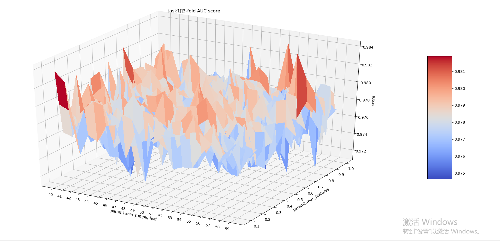

# 题目一:本题使用python3.6
 

## 题目分析

- 目标：二元分类建模及参数优化
- 数据信息
	- 数据集：20536
	- 特征数：61
	- label =1的样本数12511，label=0的样本数8025
- 模型选择：
	- 基于泛化能力、多维特征的适应性、训练速度的考量，选择随机森林算法进行分类

## 过程
- 构建随机森林模型
- 用k-fold进行validation test
- grid-search绘制3-D图

## 结果
- grid-search绘制的图如下：
 

