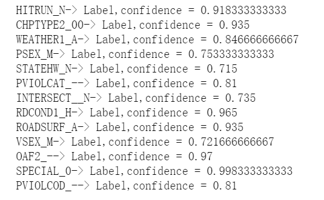
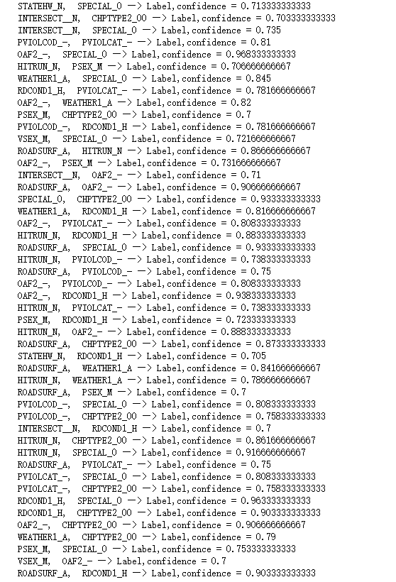

# 题目二

## 分析
- 本题只需求出左侧为1-2项的rules，因此不需要用fp-growth tree的方法，直接采用apriori的方法即可快速得到答案。

## 过程
- 采用apriori的算法进行关联规则分析
- 步骤
	- 用python读取数据，并将数据进行预处理，保留Label为true且minSupport >= 0.1的交易
	- 采用apriori算法挖掘出结果

## 结果

- 总rules数、左侧1项的rules数、左侧为2项的rules数分别为：61 13 48
	- 左侧1项的rules如下
	
	- 左侧为2项的rules如下
	
